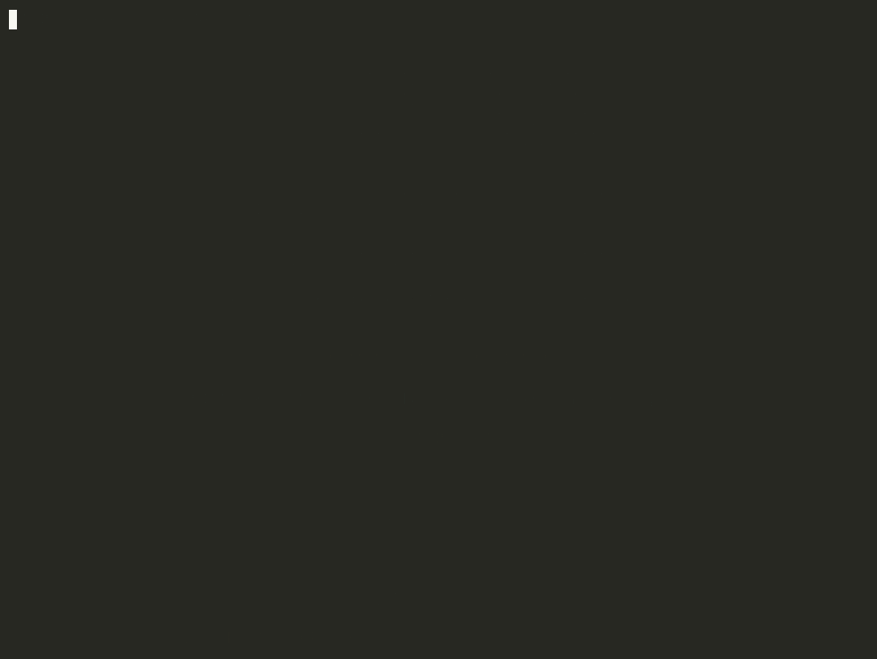
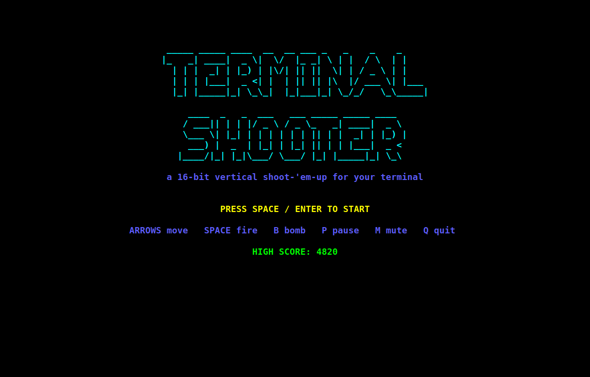
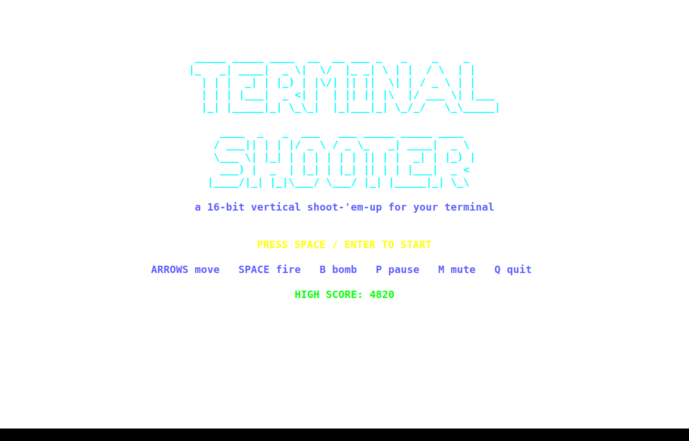
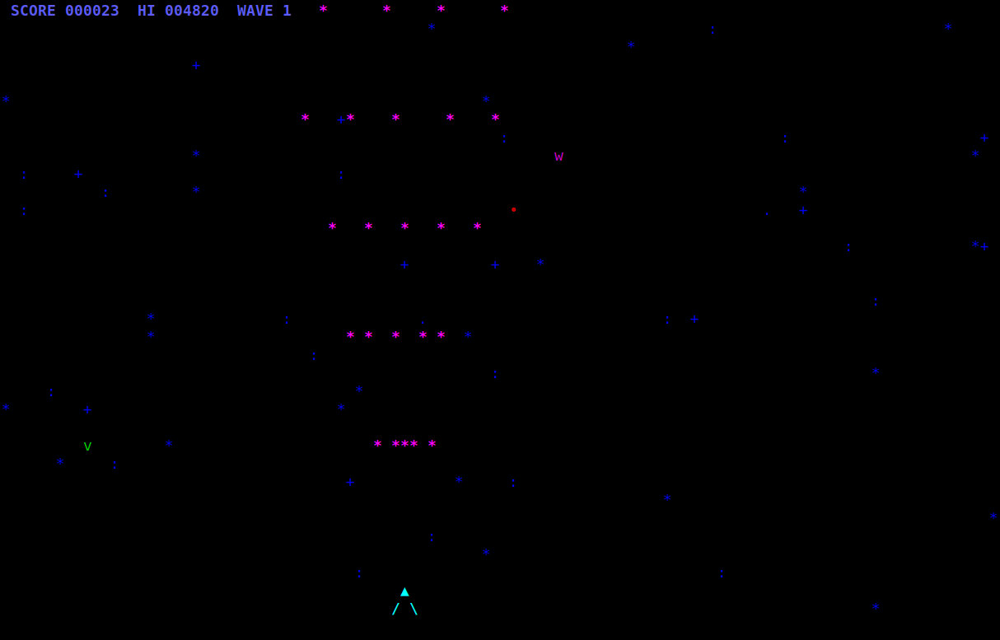
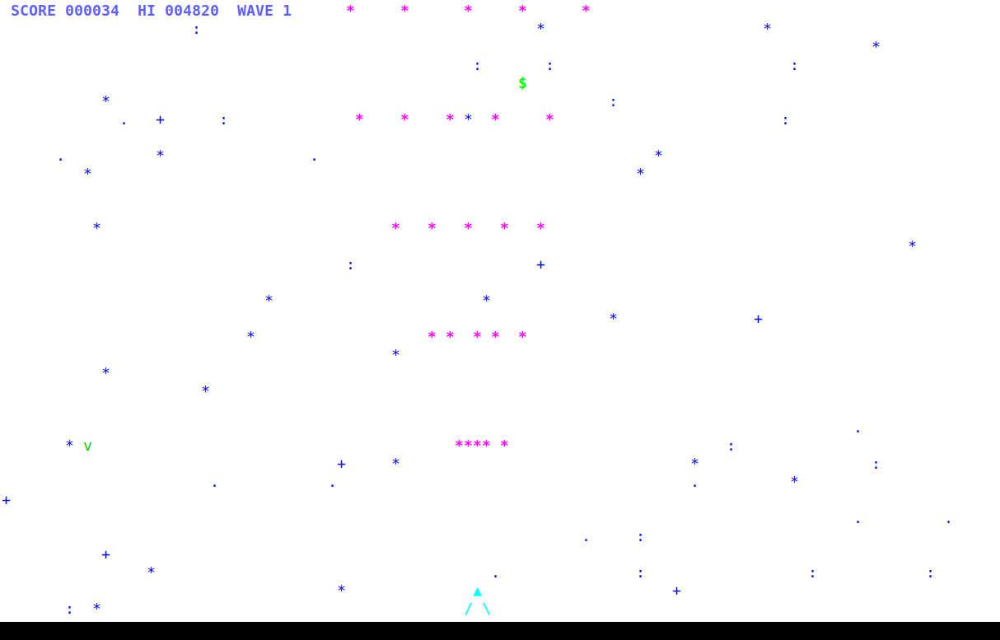
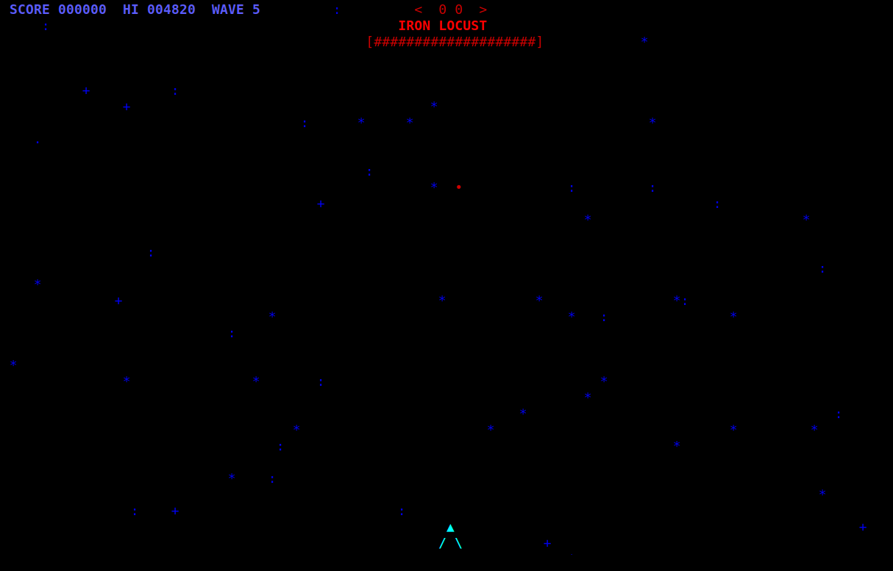
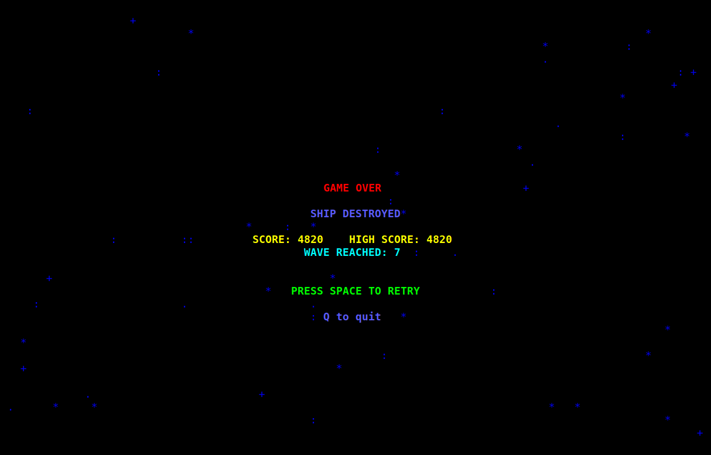

# Terminal Shooter

A 16-bit style vertical shoot-'em-up that runs entirely in your terminal — Python 3 stdlib, `curses` rendering, chiptune audio synthesized from scratch. No dependencies, no GPU, no nonsense.



**[▶ Watch it play on GitHub Pages](https://digital-coworker.github.io/terminal-shooter-sonnet-5/)**

## Play

```bash
git clone https://github.com/digital-coworker/terminal-shooter-sonnet-5.git
cd terminal-shooter-sonnet-5
python3 game.py
```

Requires Python 3.8+ on Linux or macOS. No pip installs.

| Key | Action |
|---|---|
| `↑ ↓ ← →` | Move ship |
| `Space` | Fire |
| `B` | Smart bomb (clears the screen) |
| `P` | Pause |
| `M` | Mute music |
| `Q` | Quit |

## What's in it

- **Progressive difficulty.** Enemy count, speed, and aggression scale continuously with each wave; every 5th wave is a boss with its own health bar and attack pattern.
- **A real weapon-upgrade chain**, the way Raiden / 1942 / Truxton / TwinBee / Ikaruga / Mushihimesama taught it: pick up capsules to level your fire power, or swap between **Vulcan** (widening multi-shot), **Spread** (TwinBee-style fan), **Laser** (Ikaruga-style piercing beam), and homing **Missiles** (Mushihimesama-style seekers). Shields and smart bombs stack too.
- **16-bit chiptune soundtrack**, synthesized at runtime from square/triangle/saw waves with the stdlib `wave` module — no audio libraries, no ripped samples. Falls back silently if no audio backend (`aplay`/`paplay`/`afplay`) is found.
- **Pure stdlib.** `curses` + `wave` + `subprocess`. Runs on any Linux or macOS terminal, ~800 lines of Python.

## Screenshots

| Dark terminal | Light terminal |
|---|---|
|  |  |
|  |  |

| Boss fight | Game over |
|---|---|
|  |  |

## How it's built

```
game.py                 entry point
shooter/
  game.py               curses render/input/collision loop (the engine)
  entities.py            Bullet, Enemy, Particle, PowerUp
  weapons.py             the fire-power upgrade chain
  waves.py               progressive difficulty + boss director
  audio.py               chiptune synth + best-effort playback
  assets/music/*.wav     pre-rendered 16-bit style tracks & SFX
tools/gen_music.py       regenerates the .wav assets from pure-Python synthesis
```

Colors, movement patterns, and difficulty curves are deliberately tuned rather
than random: bullet spreads widen with weapon level, boss HP and fire rate
scale with wave number, and combo timers reward accurate play — the same
knobs classic hardware shmups exposed to their designers.

## Regenerating the soundtrack

The `.wav` files are committed, but if you want to tweak the melodies:

```bash
python3 tools/gen_music.py
```

Edit the note sequences in `tools/gen_music.py` (`"A4"`, `"C#5"`, …) and rerun.

## License

MIT
